# Naviscope

**Unified Code Knowledge Graph Engine for AI Agents & Developers**

Naviscope bridges the gap between AI and IDEs. It builds a comprehensive, graph-based representation of your codebase (connecting micro-level semantics like type relationships and inheritance with macro-level structures) that powers both **LLM agents** (via MCP) and **code editors** (via LSP).

Unlike traditional tools that maintain separate indexes for different purposes, Naviscope provides a **single, unified knowledge graph**, ensuring that what AI agents see is exactly what developers navigate.

## 💡 Why Naviscope?

| Feature | Traditional Tools | Naviscope |
| :--- | :--- | :--- |
| **Context** | Text-based (regex/grep) | **Graph-based** (structural/semantic) |
| **Performance** | High latency (JVM based) | **Instant** (Rust native, Zero-JVM overhead) |
| **Consistency** | Fragmented (Agent vs IDE) | **Unified** (Same graph for both) |
| **Resilience** | Blocks on errors/missing deps | **Robust** (Works with partial/broken code) |

## 🌟 Capabilities

### 🤖 For AI Agents (MCP Support)
Naviscope implements the [Model Context Protocol](https://modelcontextprotocol.io/), giving LLMs "X-ray vision" into your code structure.

- **`ls`**: Hierarchical exploration of packages, modules, and fields.
- **`find`**: Precise symbol search (find "Class definitions", not just string matches).
- **`cat`**: Retrieve definition, source code, and metadata for any symbol.
- **`deps`**: Analyze incoming/outgoing dependencies and relationships (inheritance, type usage, etc.).

### 👨‍💻 For Developers (LSP Support)
A lightweight, lightning-fast alternative to standard language servers (like JDTLS).

- **Navigation**: Go to Definition, Find References, Go to Implementation.
- **Understanding**: Hover documentation, Document Highlights.
- **Hierarchy**: Call Hierarchy, Type Hierarchy.
- **Speed**: Works immediately on large projects without long indexing pauses.

## 🏗️ Architecture

```mermaid
graph TD
    %% Styles
    classDef layer fill:#e3f2fd,stroke:#1565c0,stroke-width:2px,rx:5,ry:5
    classDef component fill:#fff,stroke:#333,stroke-width:1px
    classDef storage fill:#fff3e0,stroke:#ef6c00,stroke-width:2px,rx:5,ry:5

    subgraph Access [Interfaces Layer]
        direction LR
        CLI[CLI Shell]:::component
        MCP["MCP Server<br/>(AI Agents)"]:::component
        LSP["LSP Server<br/>(Editors)"]:::component
    end

    subgraph Service [Query & Analysis Layer]
        direction LR
        Query[Query Engine]:::component
        Search[Semantic Search]:::component
        Deps[Dependency Analysis]:::component
    end

    subgraph Core [Core Knowledge Graph]
        direction LR
        Graph["Unified Graph<br/>(petgraph)"]:::component
        Index["Symbol Index<br/>(FQN, Name)"]:::component
        RefIndex["Reference Index<br/>(Token → Files)"]:::component
    end

    subgraph Ingestion [Ingestion Layer]
        direction LR
        Scanner[File Scanner]:::component
        Parser["Parsers<br/>(Tree-sitter)"]:::component
        Resolver["Symbol Resolver<br/>(Java/Gradle)"]:::component
    end

    subgraph Infra [Infrastructure]
        direction LR
        Store[("Persistence")]:::storage
        Watch[File Watcher]:::component
    end

    %% Connections
    CLI --> Query
    MCP --> Query
    LSP --> Query

    Query --> Graph
    Search --> Graph
    Deps --> Graph
    Search --> RefIndex

    Scanner --> Parser
    Parser --> Resolver
    Resolver --> Graph
    Resolver --> RefIndex

    Graph -.-> Store
    Watch -.-> Scanner
```



Naviscope is built on a **layered architecture** that separates ingestion, core graph logic, and external interfaces. The core is a language-agnostic graph structure populated by language-specific strategies (currently Java/Gradle via Tree-sitter), exposing a unified query engine to both AI agents and developer tools.

### 🔍 Reference Discovery Strategy

Naviscope uses a **two-phase reference discovery** approach for optimal performance:

1. **Meso-level (Coarse Filtering)**: Uses an inverted `reference_index` (token → files) to quickly identify candidate files that likely contain references to a symbol. This index is built during parsing by extracting all identifier tokens from source files.

2. **Micro-level (Precise Analysis)**: For each candidate file, uses Tree-sitter to parse and verify actual symbol occurrences, ensuring accurate reference locations.

This hybrid approach combines the speed of inverted indexing with the precision of syntax-aware parsing, enabling fast reference discovery even in large codebases.

## 🚀 Quick Start

### Prerequisites
- Rust (2024 edition)
- C Compiler (required for compiling Tree-sitter grammars)

### Installation from source code

```bash
# 1. Clone & Update Submodules (Required for tree-sitter grammars)
git clone https://github.com/biuld/naviscope.git
cd naviscope
git submodule update --init --recursive

# 2. Install the Naviscope CLI
cargo install --path .

# 3. (Optional) Build the VS Code Extension
cd editors/vscode
npm install
npm run package
# Then install the generated .vsix file in VS Code
```

### Usage

#### CLI Commands
- `naviscope index <PATH>`: Build a persistent index for a project.
- `naviscope shell [PATH]`: Start an interactive shell to query the graph.
- `naviscope watch <PATH>`: Start a background service to keep the index updated.
#### Configure in Cursor (for AI Agents)
1.  Open **Cursor Settings** (Cmd + Shift + J) -> **Features** -> **MCP**.
2.  Click **+ Add New MCP Server**.
3.  Configure:
    - **Name**: `Naviscope`
    - **Type**: `command`
    - **Command**: `naviscope mcp`

#### Configure in VS Code / NeoVim (for LSP)
- **VS Code**: Install the extension built in step 3.
- **Other Clients**: Point your LSP client to run `naviscope lsp`.

## 🛠️ Query DSL Examples

Whether using the CLI shell or MCP tools, the query logic is consistent:

```bash
# Find all classes named 'UserService'
find "UserService" --kind class

# List contents of a package
ls "com.example.service"

# Inspect full details of a symbol (source code, metadata)
cat "com.example.service.UserService"

# Find who references 'login'? (Incoming dependencies / Reverse lookups)
deps --rev "com.example.auth.AuthService.login"

# Filter dependencies by edge type
deps "com.example.User" --edge-types TypedAs,InheritsFrom
```

## 🔗 Graph Relationships

Naviscope tracks the following relationship types in the knowledge graph:

- **Structural**: `Contains` (package → class, class → method, etc.)
- **Inheritance**: `InheritsFrom`, `Implements`
- **Type Usage**: `TypedAs` (field/variable → type)
- **Annotations**: `DecoratedBy` (class/method → annotation)
- **Build System**: `UsesDependency` (project → dependency)

Reference discovery (method calls, instantiations) is handled efficiently through the `reference_index` + Tree-sitter two-phase approach, avoiding the need to store explicit call edges for every reference.

## 📈 Roadmap

- [x] **Core**: Graph Storage (`petgraph`), Parallel Indexing, Real-time Updates (`notify`).
- [x] **Languages**: Java & Gradle (Tree-sitter driven).
- [x] **Interfaces**: CLI Shell, MCP Server, LSP Server.
- [x] **Editors**: VS Code Extension.
- [x] **Reference Discovery**: Two-phase approach (reference_index + Tree-sitter).
- [ ] **Upcoming**: Maven Support, Python/Rust Language Strategies.

## 📄 License

This project is licensed under the MIT License - see the LICENSE file for details.
