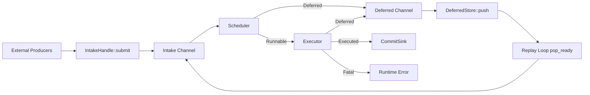

# naviscope-ingest

`naviscope-ingest` is a resident, event-driven runtime for dependency-aware message processing.

## Design Goals

- Keep domain semantics in `core`; keep orchestration in `ingest`.
- Support multi-producer push ingestion with bounded backpressure.
- Model dependency handling as data (`depends_on`) and deferred replay.
- Provide deterministic commit boundaries (`epoch`) with external commit policy.

## Scope

In scope:

- Message intake and bounded queueing.
- Event-driven schedule/execute/commit orchestration.
- Deferred persistence and replay trigger path.
- Runtime metrics hooks.

Out of scope:

- Domain/business rule evaluation.
- Source scanning / incremental detection / build-source partitioning.
- Storage engine internals.

## Core Architecture

The runtime is centered around:

- `IngestRuntime<P, Op>`
- `RuntimeComponents<P, Op>`
- `PipelineEvent<P, Op>`
- `PipelineBus<P, Op>` with **two channels**:
- `intake` channel for ingress + replayed messages
- `deferred` channel for unresolved messages

## Event Model

`PipelineEvent<P, Op>` is the runtime contract between components:

- `Runnable(Message
)`
- `Deferred(Message
)`
- `Executed { epoch, result }`
- `Fatal { msg_id, error }`

This keeps routing explicit and avoids stage-specific output structs.

## Component Model

Runtime uses object-safe component interfaces:

- `Scheduler<P, Op>`
- `Executor<P, Op>`
- `DeferredStore
`
- `CommitSink<Op>`
- `RuntimeMetrics`
- `PipelineBus<P, Op>`

They are assembled through `RuntimeComponents<P, Op>`.

## Public API

- `IngestRuntime::new(config, components)`
- `IngestRuntime::intake_handle() -> IntakeHandle
`
- `IngestRuntime::notify_dependency_ready(event)`
- `IngestRuntime::run_forever()`

### Ingestion

External code pushes messages through:

- `IntakeHandle::submit(message).await`

### Dependency Ready Notification

External dependency resolution notifies runtime through:

- `notify_dependency_ready(DependencyReadyEvent)`

This unblocks replay via `DeferredStore`.

## Runtime Flow

1. Producers push `Message
` into intake channel.
2. Kernel applies flow control (`max_in_flight`) and schedules each message.
3. `Scheduler` emits `PipelineEvent` values.
4. `Runnable` messages are executed immediately by `Executor`.
5. `Executed` events are grouped by epoch (within one message execution) and sent to `CommitSink`.
6. `Deferred` events go to deferred channel and are persisted by deferred sink.
7. Kernel replay loop polls `DeferredStore::pop_ready(limit)` and reinjects ready messages.

## Backpressure and Memory

- Both channels are bounded by `kernel_channel_capacity`.
- No extra ingress queue beyond bus channels.
- Deferred replay is pulled with `deferred_poll_limit`, limiting replay burst.

## RuntimeConfig

- `deferred_poll_limit`: max replay load per poll cycle.
- `kernel_channel_capacity`: channel capacity for intake/deferred.
- `max_in_flight`: max concurrent message workers inside kernel.
- `idle_sleep_ms`: replay loop sleep when no ready deferred message exists.

## Correctness Assumptions

- At-least-once processing; consumers should be idempotent.
- `DeferredStore` handles dedup/retry/readiness semantics.
- `CommitSink` defines commit visibility and idempotency policy.

## Source Layout

- `src/runtime/mod.rs`: runtime assembly, handles, lifecycle.
- `src/runtime/kernel.rs`: event routing kernel + bus + worker loops.
- `src/traits.rs`: component contracts.
- `src/types.rs`: message/event/domain-neutral runtime types.
- `src/error.rs`: runtime error types.
