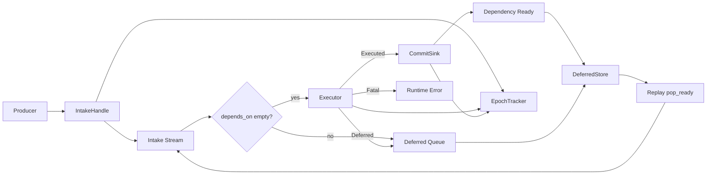
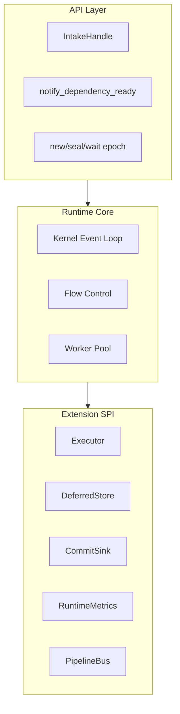
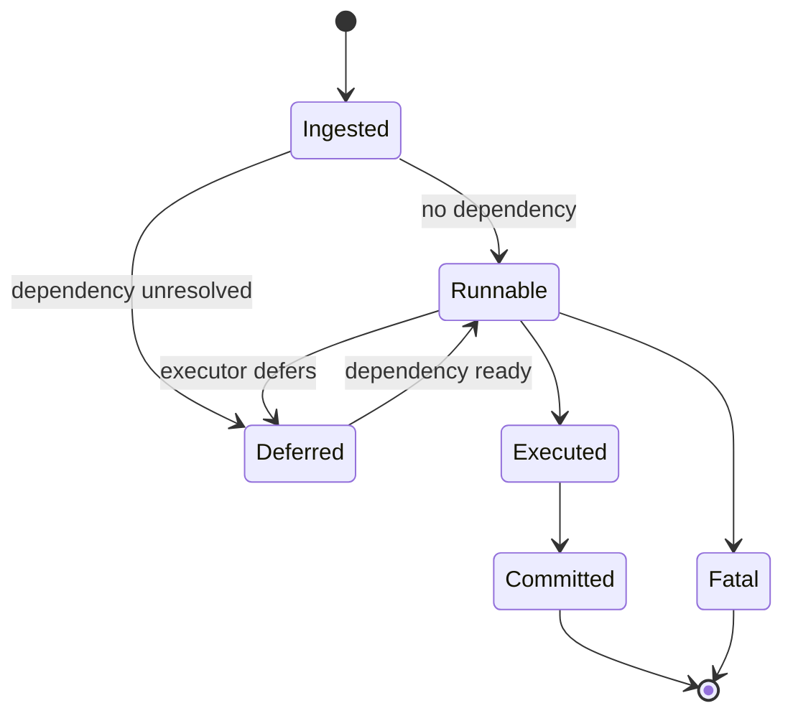
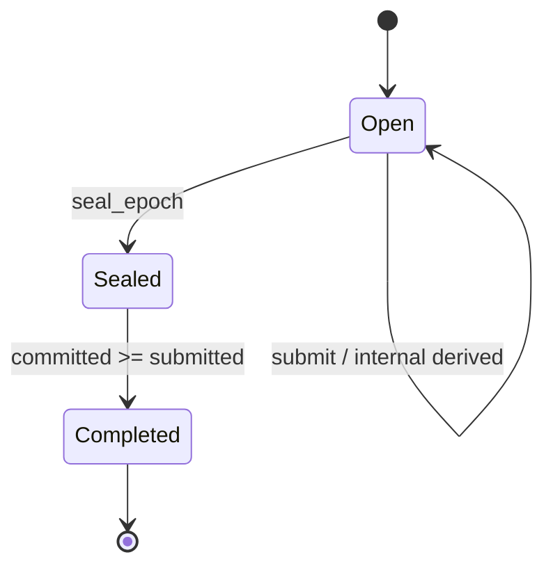
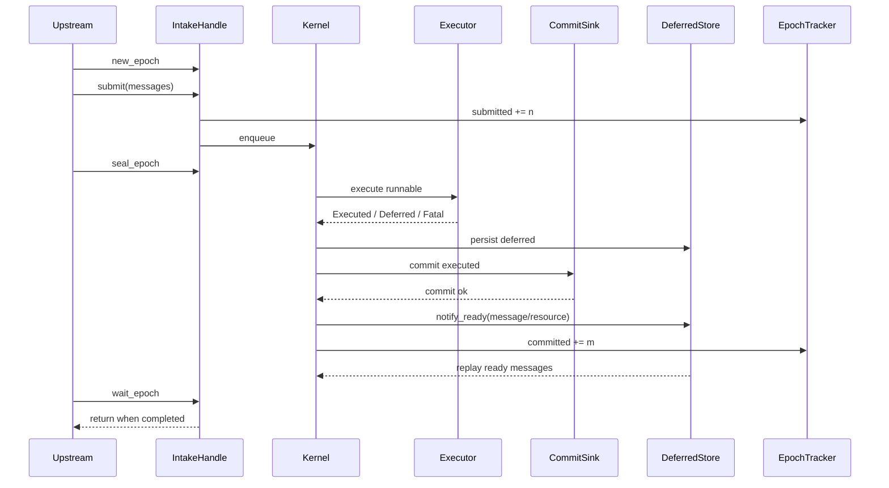

# naviscope-ingest

## 1. Definition

`naviscope-ingest` is a DAG execution runtime built on a message queue.

It drives task transitions between `runnable` and `deferred` via dependencies (`depends_on`), and uses `epoch` for batch completion semantics.

- Component type: runtime middleware
- Input: `Message
`
- Output: committed operation results through `CommitSink<Op>`
- Goal: stable dependency-aware execution and batch completion under high concurrency

## 2. Responsibility Boundaries

### 2.1 In Scope

- Message intake and backpressure control
- Deferred persistence and replay for unresolved dependencies
- Dependency-ready event dispatch (`message` / `resource`)
- Batch (`epoch`) completion lifecycle
- Unified runtime observability hooks

### 2.2 Out of Scope

- Business semantics
- Source scanning and incremental discovery
- Concrete storage engine strategy

## 3. Architecture Model

## 4. Runtime Layers

## 5. Lifecycle Model

### 5.1 Message Lifecycle

### 5.2 Epoch Lifecycle

## 6. Processing Sequence

## 7. Extension Contracts (SPI)

- `Executor<P, Op>`: business execution and event emission
- `DeferredStore
`: deferred storage, readiness evaluation, and replay source
- `CommitSink<Op>`: commit boundary and visibility control
- `RuntimeMetrics`: metrics collection
- `PipelineBus<P, Op>`: channel model abstraction

## 8. Semantic Guarantees

- Processing semantics: at-least-once
- Idempotency: `Executor` and `CommitSink` should provide idempotency as needed
- Epoch completion: after `seal_epoch`, completion is `committed >= submitted`
- Internally derived deferred messages are counted into the same epoch's `submitted`

## 9. Integration Checklist

1. Assemble `RuntimeComponents` (`Executor` / `DeferredStore` / `CommitSink` / `RuntimeMetrics` / `PipelineBus`).
2. Start `IngestRuntime::run_forever()`.
3. Submit batches through `IntakeHandle` and wait with epoch APIs.
