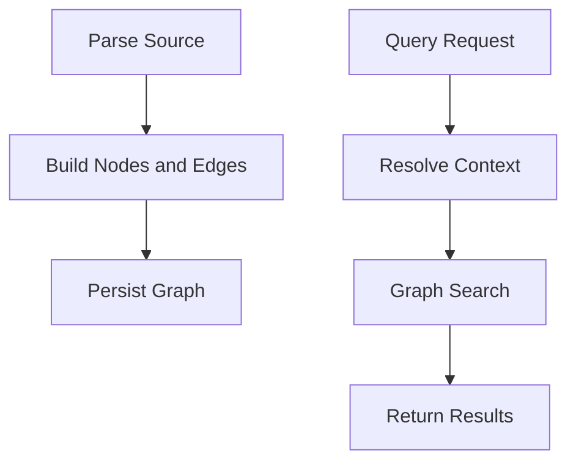

# Code Graph

## What It Represents
The graph is the unified representation of code semantics. Every symbol is a node, and relationships between symbols are edges. It is the single source of truth for queries across CLI, LSP, and MCP.

## Node Model
Nodes include packages, types, fields, methods, and variables. Each node has:
- A stable `NodeId`
- A `NodeKind`
- Metadata produced by language plugins
- A source classification (project, external, builtin)

## Edge Types
- Structural containment (package -> class -> method)
- Inheritance and implementation
- Type usage and annotations
- Build system relationships

## Indexing and Queries

## Consistency and Versioning
- `NodeId` must be stable across source and bytecode.
- Metadata is versioned for forward compatibility.
- External asset changes invalidate cached stubs.

## Operational Notes
- The graph is language-agnostic.
- Plugins are responsible for semantic accuracy.
- External symbols are first-class nodes.
