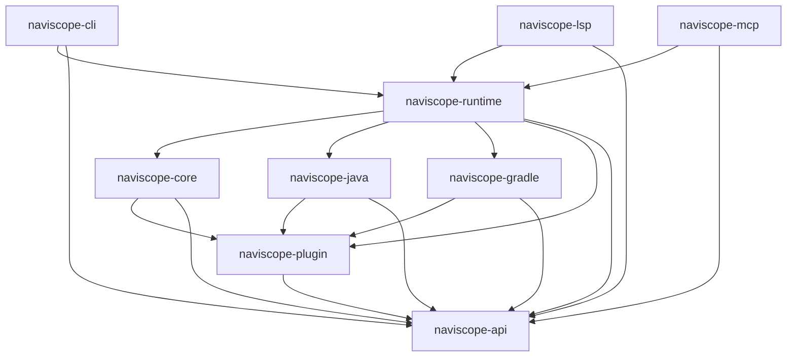

# Crate Map

## Layered Structure

## What Each Layer Provides
- **API**: shared models plus engine service traits (`GraphService`, `NavigationService`, semantic traits, `EngineLifecycle`) and the composite `NaviscopeEngine`.
- **Plugin**: capability traits (`*Cap` + runtime semantic services) for language/build integrations; keeps Core independent.
- **Core**: graph storage, indexing, persistence, and asset services.
- **Runtime**: orchestration, lifecycle, background tasks, and query serving.
- **Language/Build**: concrete strategies (Java parsing, Gradle structure resolution).
- **Interfaces**: CLI/LSP/MCP entry points that expose the same graph.

## Flow Through Crates
1. Interfaces call Runtime to build an index or run a query.
2. Runtime invokes language/build plugins to parse and resolve structure.
3. Plugins emit nodes/edges into Core Graph.
4. Runtime serves queries from Core Graph and coordinates background stubbing.
