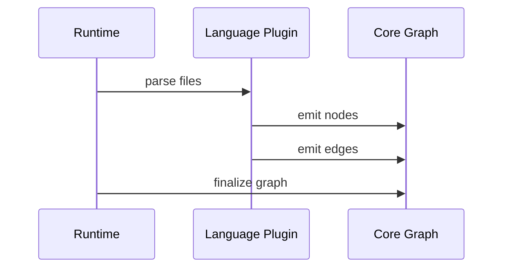

# Indexing Pipeline

## Inputs and Parsing
- Language plugins discover and parse source files.
- Build-tool plugins resolve project/module structure.
- Parsing produces symbol definitions and references.

## Graph Construction Flow

## Incremental Updates
- File change detection triggers partial re-index.
- Only affected nodes and edges are rebuilt.
- External caches remain stable between runs.

## Concurrency and Performance
- Parsing and indexing are parallelized.
- Asset scanning runs in the background.
- Queries read from the current graph state without waiting for stubs.

## Fault Tolerance
- Partial indexing is allowed.
- Errors are isolated per file.
- The system returns best-effort results.
