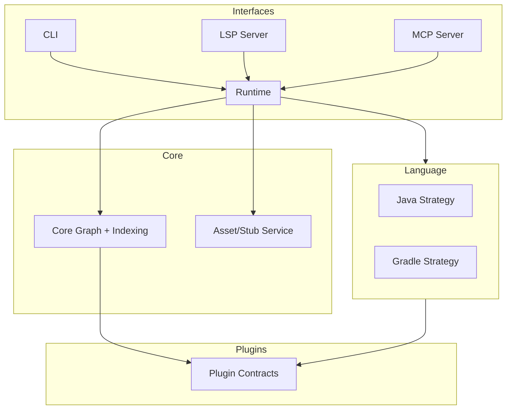
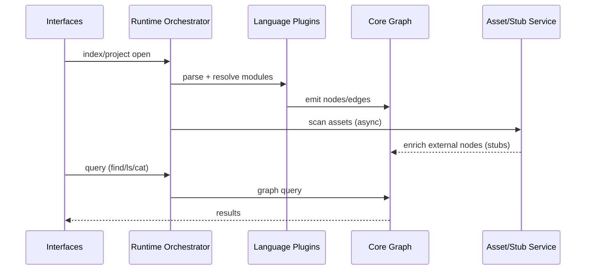

# System Overview

## Purpose
Naviscope builds a unified code knowledge graph that serves both AI agents (MCP) and developer tools (LSP/CLI). The system is designed for fast startup, incremental enrichment, and consistent semantics across interfaces.

## High-Level Architecture

## Main Flow (Index + Query)

## How to Read the System
- The **Runtime Orchestrator** is the control plane: it wires plugins, triggers indexing, and serves queries.
- The **Core Graph** is the single source of truth: all interfaces read from it.
- The **Asset/Stub Service** enriches external symbols without blocking startup.
- **Plugins** supply language/build-tool-specific logic; Core stays language-agnostic.

## Key Design Expectations
- Indexing should be usable even if external dependencies are still scanning.
- External symbols must be represented as first-class nodes, not special cases.
- The same symbol must have a stable `NodeId` across source and bytecode.
