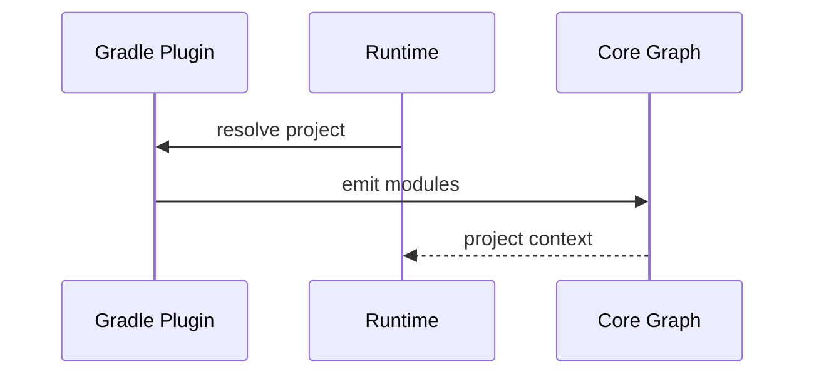

# Gradle Integration

## Purpose
Gradle integration provides project structure and dependency metadata for indexing without relying on executing Gradle builds.

## Scope and Boundaries
- Resolve modules and project structure
- Delegate external asset discovery to global scanners
- Avoid heavy Gradle invocation during indexing

## Module Resolution

## Dependency Extraction
- Read Gradle metadata when available
- Prefer static configuration to avoid execution

## Edge Cases
- Composite builds
- Custom configurations
