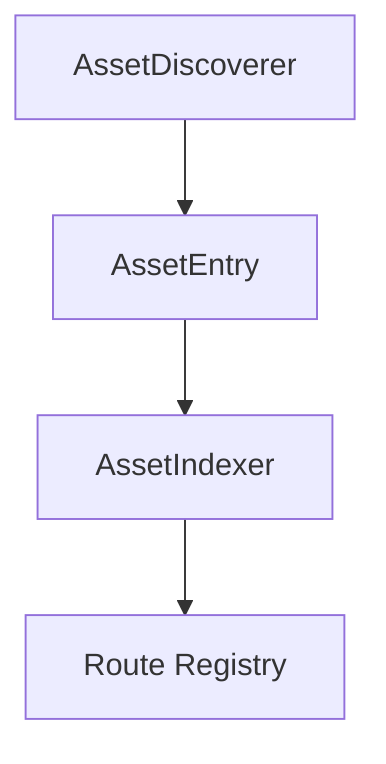

# Asset Scanner

## Purpose
The asset scanner discovers external libraries (JAR/JMOD/class files) and builds package-prefix routes used by resolvers and stub generators.

## Core Flow

## Responsibilities
- Find assets from multiple sources (JDK, Gradle, Maven, local)
- Index assets to extract package prefixes
- Register routes for fast FQN lookup

## Route Registry Behavior
- Prefix to asset mapping
- Multiple candidates per prefix (split packages)
- Source metadata for debugging and conflict resolution

## Streaming Scan and Memory Model
- Discoverers yield assets as iterators
- Registry is updated incrementally
- No full asset list held in memory

## Failure Handling
- Skip unreadable assets
- Keep partial routes and continue scanning
