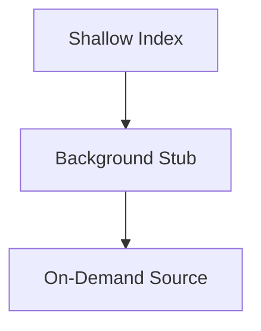

# Classpath Three-Tier Design

## Goal
Balance instant usability with deep understanding of external dependencies by layering the resolution strategy.

## Three Tiers

## What Each Tier Does
- **Shallow Index**: project source is indexed immediately; external symbols become placeholders.
- **Background Stub**: bytecode is parsed to enrich external placeholders.
- **On-Demand Source**: `*-sources.jar` is parsed when a user requests source.

## Build vs Query Timeline
- Build: project graph + external placeholders
- Runtime: background stubs fill metadata
- Query: source resolution for precise navigation

## Contracts
- Placeholder nodes must be upgradable.
- `NodeId` must be identical across source and bytecode.
- Cache invalidates on asset changes.

## Practical Notes
- Prioritize referenced external symbols.
- Never block initial navigation on external scans.
