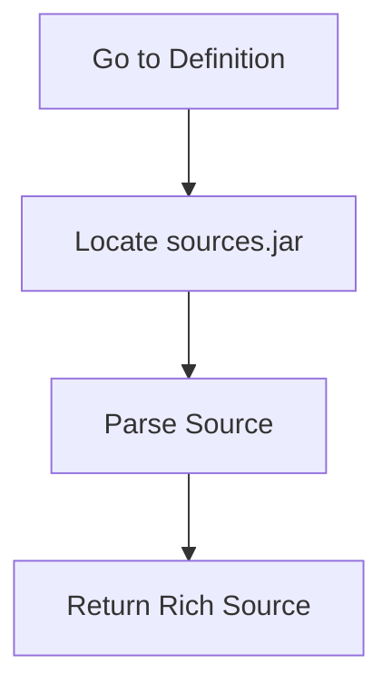

# Source Resolution

## Purpose
Source resolution attaches real source code to external symbols at query time, improving navigation and documentation visibility.

## Flow

## Relationship to Stubs
- Stubs provide structure and fast navigation
- Source parsing adds comments and full body
- Fallback to stubs when sources are missing

## UX Notes
- On-demand only to avoid startup cost
- Clear messaging when sources are unavailable
