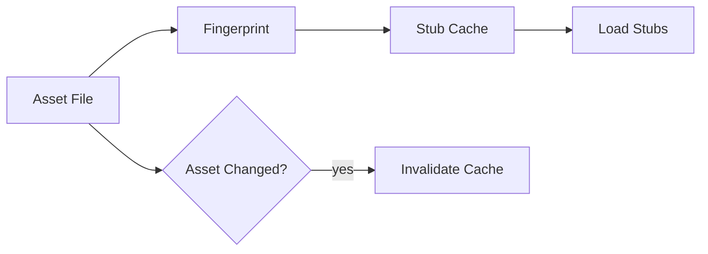

# Stub Cache

## Purpose
The stub cache stores parsed external symbol metadata so that repeated projects can reuse the same external knowledge without re-parsing bytecode.

## Flow

## Key Behaviors
- Cache key is asset fingerprint
- Cached payload is compressed and versioned
- Stubs are shared across projects

## Invalidation
- Any asset file change invalidates its cache
- Versioned metadata enables safe migrations
