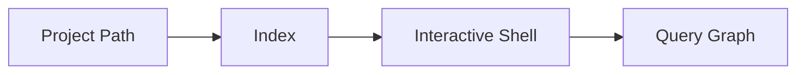

# CLI Interface

## Purpose
The CLI provides direct access to indexing and graph exploration for developers and agents in terminal workflows.

## Commands and Flags
- Index, shell, watch, clear
- Cache operations and diagnostics

## Common Flow

## Output Formats
- Human-readable tables
- Machine-friendly JSON where applicable
