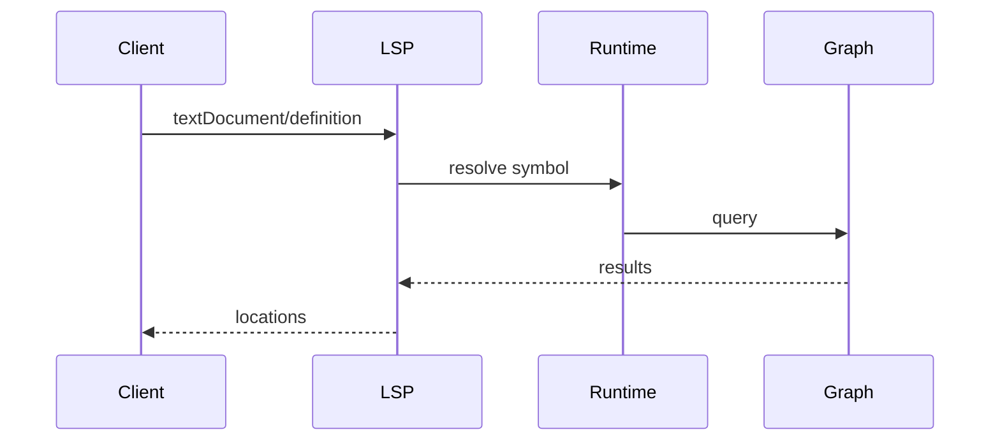

# LSP Interface

## Purpose
LSP exposes navigation and insight features to editors using the same graph as CLI/MCP.

## Supported Capabilities
- Definition, references, implementation
- Hover, symbols, hierarchy

## Request/Response Mapping

## Performance Considerations
- Avoid full re-index on open
- Serve from graph cache first
