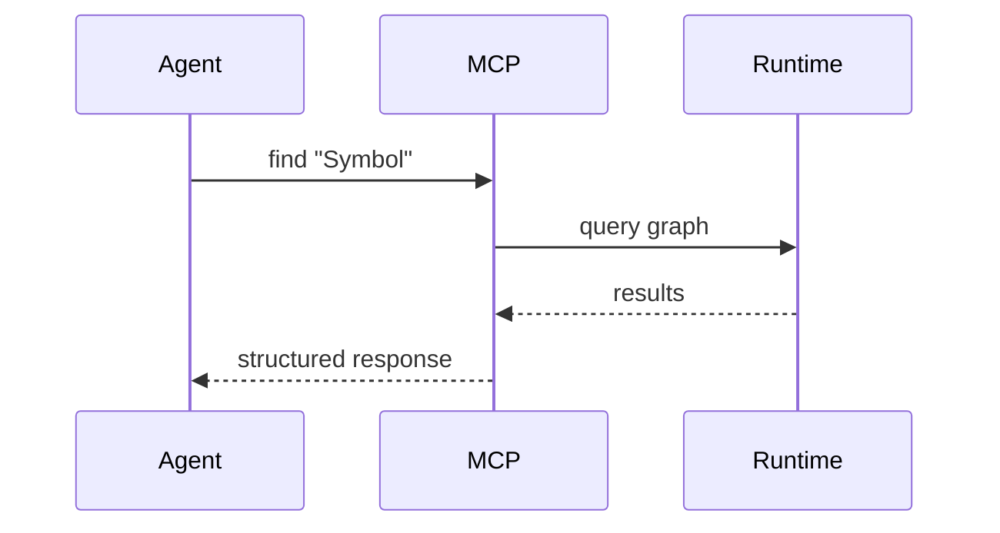

# MCP Interface

## Purpose
MCP exposes graph queries to AI agents via a stable tool surface. It is optimized for structured, precise context delivery.

## Tooling Surface
- `get_guide`
- `ls`, `find`, `cat`, `deps`

## Usage Flow

## Safety and Limits
- Read-only by default
- Resource limits per request
