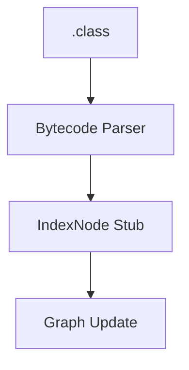

# Java Language Strategy

## Parsing
- Tree-sitter based source parsing
- Package and type extraction
- Identifier indexing for reference discovery

## Bytecode Stubs

## Inheritance and Type System
- Class and interface relations
- Field and method signatures
- Access modifiers and annotations

## Edge Cases
- Inner classes
- Generics and annotations
- Split packages across multiple JARs
