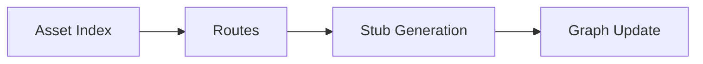

# Plugin Contracts

## Purpose
Plugin contracts define how language and build-tool integrations attach their logic to the core engine without introducing hard dependencies.

## LanguagePlugin Responsibilities
- Provide parsing and semantic analysis
- Emit nodes and edges into the graph
- Optionally expose an external resolver for stubs and sources

## BuildToolPlugin Responsibilities
- Resolve module structure
- Provide dependency metadata
- Avoid executing build tools where possible

## ExternalResolver Flow

## Compatibility Notes
- Traits are stable and versioned
- Metadata serialization is forward-compatible
- Default implementations should degrade gracefully
