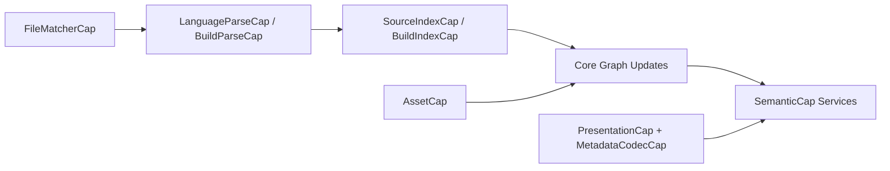

# Plugin Contracts

## Purpose
`naviscope-plugin` defines capability-oriented contracts that let language/build integrations plug into Core without hard dependencies on concrete crates.

## Capability Groups

### 1. File Matching and Parsing
- `FileMatcherCap`: decides whether a plugin handles a path.
- `LanguageParseCap`: parses language source files.
- `BuildParseCap`: parses build-tool files.

### 2. Index Construction
- `SourceIndexCap`: compiles one source file into `ResolvedUnit`.
- `BuildIndexCap`: compiles build files into `(ResolvedUnit, ProjectContext)`.
- `ProjectContext`: shared indexing context (for module/path mappings and cross-file coordination).

### 3. Runtime Semantics
- `SymbolResolveService`: resolve symbol at position.
- `SymbolQueryService`: match symbols, infer types, find implementations.
- `LspSyntaxService`: incremental parse, symbol extraction, occurrence discovery.
- `ReferenceCheckService`: semantic reference/subtype checks.
- `SemanticCap`: composite runtime semantic contract above.

### 4. Asset and Stub Integration
- `AssetCap`: optional entry for:
  - asset discoverer
  - asset indexer
  - source locator
  - stub generator

### 5. Presentation and Metadata
- `PresentationCap`: naming convention, node presentation, symbol kind mapping.
- `MetadataCodecCap`: pluggable metadata encode/decode strategy.

## Registration Shape
Language crates register capabilities via `LanguageCaps`, selectively wiring only the capabilities they support. Missing capabilities should degrade gracefully through trait defaults.

## Runtime Flow

## Compatibility Notes
- Prefer additive trait evolution (new default methods / new optional caps).
- Keep metadata codecs backward-compatible by versioning serialized payloads.
- Keep capability boundaries stable so runtime wiring remains predictable.
