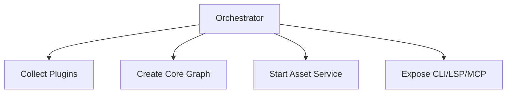

# Runtime Orchestrator

## Purpose
The orchestrator wires plugins, builds the graph, runs background tasks, and serves queries. It is the control plane for the engine.

## Assembly Flow

## Lifecycle
- Build project graph first
- Start asset scanning in the background
- Serve queries immediately
- Upgrade placeholders as stubs arrive

## Injection Points
- AssetStubService
- Language plugin registry
- Cache managers
